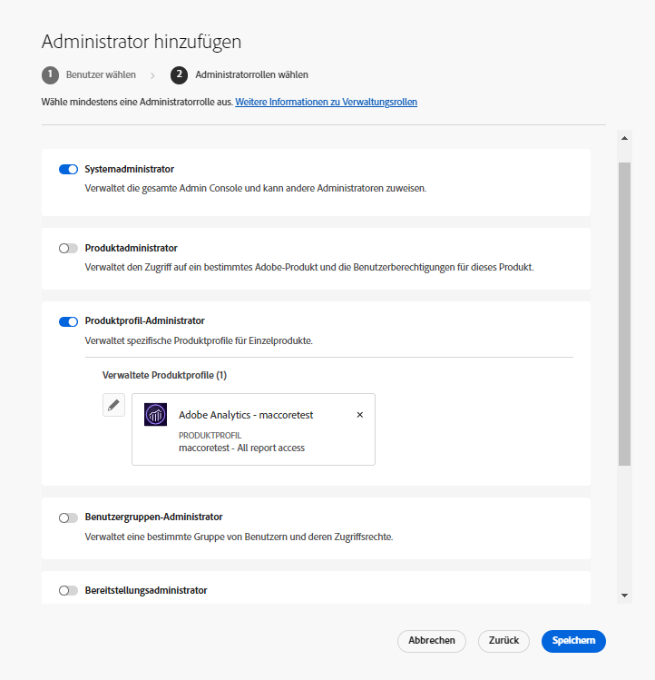
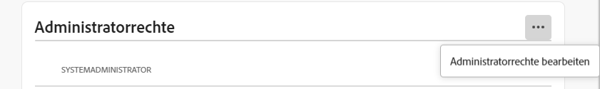
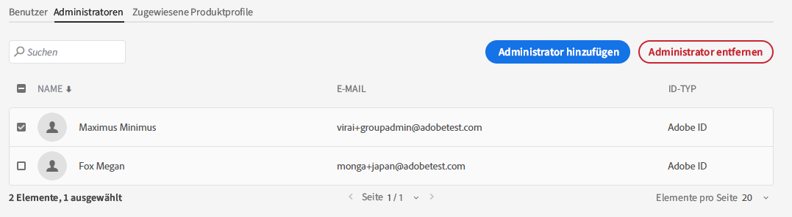

# Administratorrollen

Mithilfe der Adobe Admin Console können Unternehmen eine flexible Verwaltungshierarchie einrichten, mit der genau festgelegt werden kann, wer auf Adobe-Produkte zugreifen und sie verwenden kann. Ein oder mehrere Systemadministratoren, die während des Unternehmens-Onboarding-Prozesses festgelegt werden, befinden sich in der Hierarchie ganz oben. Diese Systemadministratoren verfügen über die Gesamtkontrolle über das System und können einzelne Zuständigkeiten an andere Administratoren übertragen.

Administratorrollen bieten Unternehmen die folgenden Hauptvorteile:

* Kontrollierte Dezentralisierung von Verwaltungsaufgaben
* Schnelle Übersicht über Produktzuweisungen – aufgeschlüsselt nach Benutzer und Produkt
* Möglichkeit zur Zuweisung von Kontingenten an Produktadministratoren

## Verwaltungshierarchie

Gilt für: Unternehmenskunden von Adobe.

Die Verwaltungshierarchie kann auf die individuellen Anforderungen Ihres Unternehmens angepasst werden. So kann ein Unternehmen beispielsweise unterschiedliche Administratoren für die Berechtigungsverwaltung für Adobe Creative Cloud- und Adobe Marketing Cloud-Angebote einsetzen. Alternativ kann ein Unternehmen unterschiedliche Administratoren zur Berechtigungsveraltung von Benutzern ernennen, die zu verschiedenen Geschäftsbereichen gehören.

>[!NOTE]
>
>Die Verwaltungshierarchie gilt nicht für Team-Kunden. Team-Kunden haben nur eine einzige **Systemadministrator**-Rolle. Der Vertragseigentümer (_zuvor **primärer Administrator**_genannt) ist der Systemadministrator und hat Zugriff auf die Vertragsdetails und den Abrechnungsverlauf. Wenn Sie der aktuelle Vertragseigentümer sind, können Sie einen bestehenden Systemadministrator (_ zuvor als **sekundärer Administrator**_ bezeichnet) zum Vertragseigentümer ernennen.

_Hierarchie der Administratorrollen_

| Rolle | Beschreibung |
|--- |--- |
| **Systemadministrator** | Superuser im Unternehmen; darf alle Verwaltungsaufgaben in der Admin Console ausführen. Außerdem ist er berechtigt, anderen Benutzern die folgenden Verwaltungsfunktionen zuzuweisen: Produktadministrator, Produktprofiladministrator, Benutzergruppenadministrator, Bereitstellungsadministrator und Support-Administrator. |
| **Produktadministrator** | Verwaltet die diesem Administrator zugewiesenen Produkte und alle damit verbundenen Verwaltungsfunktionen, darunter:<ul><li>Erstellen von Produktprofilen</li><li>Hinzufügen von Benutzern und Benutzergruppen zum Unternehmen, nicht jedoch Entfernen daraus</li><li>Hinzufügen von Benutzern und Benutzergruppen zu Produktprofilen oder Entfernen daraus</li><li>Hinzufügen von Produktprofiladministratoren zu Produktprofilen oder Entfernen daraus</li><li>Hinzufügen anderer Produktadministratoren zu dem Produkt oder Entfernen daraus</li><li>Hinzufügen von Gruppenadministratoren zu Gruppen oder Entfernen daraus</li></ul> |
| **Produktprofiladministrator** | Verwaltet die diesem Administrator zugewiesenen Produktprofilbeschreibungen sowie alle damit verbundenen Verwaltungsfunktionen, darunter:<ul><li>Hinzufügen von Benutzern und Benutzergruppen zum Unternehmen, nicht jedoch Entfernen daraus</li><li>Hinzufügen von Benutzern und Benutzergruppen zu Produktprofilen oder Entfernen daraus</li><li>Zuweisen oder Widerrufen von Produktberechtigungen für Benutzer und Benutzergruppen in Produktprofilen</li><li>Verwalten der Produktrollen von Benutzern und Benutzergruppen für Produktprofile |
| **Benutzergruppenadministrator** | Verwaltet die diesem Administrator zugewiesenen Benutzergruppenbeschreibungen und alle damit verbundenen Verwaltungsfunktionen, darunter:<ul><li>Hinzufügen von Benutzern zu Gruppen oder Entfernen daraus</li><li>Hinzufügen von Benutzergruppenadministratoren zu Gruppen oder Entfernen daraus |
| **Bereitstellungsadministrator** | Erstellt, verwaltet und implementiert Software-Pakete und Updates für Endbenutzer. |
| **Support-Administrator** | Nicht-administrative Rolle, die Zugriff auf Support-relevante Informationen hat, z. B. von Kunden gemeldete Problemberichte. |
| **Speicheradministrator** | Verwaltet die Speichersysteme des Unternehmens. Der Administrator kann den Speicherverbrauch sowohl aktiver als auch inaktiver Benutzer anzeigen und Inhalte an Empfänger senden. |

Eine detaillierte Liste der Berechtigungen für jede Administratorrolle finden Sie unter [Berechtigungen](#enterprise-admins-permissions-matrix).

## Hinzufügen eines Unternehmensadministrators Rolle {#add-enterprise-role}

Gilt für: Unternehmenskunden von Adobe.

Als Administrator können Sie anderen Benutzern eine Administratorrolle zuweisen und die gleichen Berechtigungen gewähren, wie Sie selbst besitzen. Zusätzlich können Sie ihnen auch, wie [oben](#administrative-hierarchy) beschrieben, Rechte für eine Rolle zuweisen, die in der Hierarchie unter der Ihren liegt. Als Produktadministrator können Sie beispielsweise einem Benutzer Produktadministratorberechtigungen oder Produktprofil-Administratorberechtigungen zuweisen, nicht aber die Berechtigungen eines Bereitstellungsadministrators. Informationen zu den in der Admin Console verfügbaren Berechtigungen finden Sie in der [Berechtigungsmatrix](#enterprise-admins-permissions-matrix).

So fügen Sie einen Administrator hinzu oder laden ihn ein:

1. Wählen Sie in der [Admin Console](https://adminconsole.adobe.com/) die Option **Benutzer** > **Administratoren**.

   Alternativ können Sie zum entsprechenden Produkt, zum Produktprofil oder zur Benutzergruppe navigieren und den Tab **Administratoren** öffnen.

1. Klicken Sie auf **Administrator hinzufügen**.
1. Geben Sie einen Namen oder eine E-Mail-Adresse ein. Sie können nach vorhandenen Benutzern suchen oder einen neuen Benutzer hinzufügen, indem Sie eine gültige E-Mail-Adresse angeben und die entsprechenden Felder am Bildschirm ausfüllen.
1. Klicken Sie auf **Weiter**. Eine Liste der Administratorrollen öffnet sich.

>[!NOTE]
>
>* Die auf diesem Bildschirm angezeigten Optionen hängen von Ihrem Konto und Ihrer Administratorrolle ab. Sie können entweder dieselben Berechtigungen vergeben, die Sie selbst besitzen, oder Berechtigungen für eine Rolle zuweisen, die in der Hierarchie unter Ihrer liegen.
>* Als Systemadministrator eines Teams können Sie nur eine einzige Administratorrolle zuweisen: die des Systemadministrators.

1. Wählen Sie eine oder mehrere Administratorrollen aus.
1. Wählen Sie für Administratortypen wie Produktadministrator, Produktprofiladministrator und Benutzergruppenadministrator die spezifischen Produkte, Profile und Gruppen aus.

>[!NOTE]
>
>Für einen Produktprofiladministrator können Sie Profile für mehr als ein Produkt einbeziehen.

1. Überprüfen Sie die zugewiesenen Administratorrollen und klicken Sie auf **Speichern**.

Der Benutzer erhält per E-Mail eine Einladung zu den neuen Administratorrechten von `message@adobe.com`.

Benutzer müssen in der E-Mail auf **Erste Schritte** klicken, um Mitglied des Unternehmens zu werden. Wenn neue Administratoren den Link **Erste Schritte** in der E-Mail-Einladung nicht anklicken, können sie sich nicht bei der Admin Console anmelden.

Im Rahmen des Anmeldeprozesses können Benutzer aufgefordert werden, ein Benutzerprofil einzurichten, wenn sie noch keines haben. Wenn Benutzer mehrere Profile haben, die mit ihrer E-Mail-Adresse verknüpft sind, müssen sie „Team beitreten“ anklicken (wenn Sie dazu aufgefordert werden) und danach das mit dem neuen Unternehmen verknüpfte Profil auswählen.

## Hinzufügen eines Team-Administrators {#add-admin-teams}

Gilt für: Team-Kunden von Adobe.

Als Administrator können Sie anderen Benutzern die Systemadministratorrolle zuweisen und die gleichen Berechtigungen gewähren, die Sie selbst haben.

So fügen Sie einen Systemadministrator hinzu oder laden einen Systemadministrator ein:

1. Wählen Sie in der Admin Console **Benutzer** > **Administratoren**.

   Eine Liste der vorhandenen Administratoren wird angezeigt.

1. Klicken Sie auf **Administrator hinzufügen**.

   Der Bildschirm **Administrator hinzufügen** wird geöffnet.

1. Geben Sie einen Namen oder eine E-Mail-Adresse ein. Sie können nach vorhandenen Benutzern suchen oder einen neuen Benutzer hinzufügen, indem Sie eine gültige E-Mail-Adresse angeben und die entsprechenden Felder am Bildschirm ausfüllen.

   Standardmäßig ist „Systemadministrator“ ausgewählt.

1. Klicken Sie auf **Speichern**.

Da alle Benutzer in einem Team-Unternehmen Business-ID-Benutzer sind, erhalten sie eine E-Mail-Einladung zu den neuen Administratorrechten von `message@adobe.com`.
Benutzer müssen in der E-Mail auf „Erste Schritte“ klicken, um dem Unternehmen beizutreten.

Im Rahmen des Anmeldeprozesses können Benutzer aufgefordert werden, ein Benutzerprofil einzurichten, wenn sie noch keines haben. Wenn Benutzer mehrere Profile haben, die mit ihrer E-Mail-Adresse verknüpft sind, müssen sie „Team beitreten“ anklicken (wenn Sie dazu aufgefordert werden) und danach das mit dem neuen Unternehmen verknüpfte Profil auswählen.

## Bearbeiten der Unternehmensadministratorrolle

Gilt für: Unternehmenskunden von Adobe.

Als Administrator können Sie die Administratorrolle anderer Administratoren bearbeiten, die sich in der Verwaltungshierarchie unter Ihnen befinden. Sie können Sie beispielsweise Admininistratorrechte anderer Administratoren entfernen.

So bearbeiten Sie Administratorrollen:

1. Wählen Sie in der Admin Console **Benutzer** > **Administratoren**. Die Liste der vorhandenen Administratoren wird angezeigt.

   Alternativ können Sie zum entsprechenden Produkt, zum Produktprofil oder zur Benutzergruppe navigieren und den Tab **Administratoren** öffnen.

1. Klicken Sie auf den Namen des zu bearbeitenden Administrators.
1. Klicken Sie in den **Benutzerdetails** auf das  für den Abschnitt **Administratorrechte** und wählen Sie **Administratorrechte bearbeiten** aus.

   

1. Bearbeiten Sie die Administratorrechte und speichern Sie Ihre Änderungen.

## Bearbeiten der Team-Administratorrolle

Gilt für: Team-Kunden von Adobe.

Als Team-Systemadministrator können Sie die Systemadministratorberechtigungen anderer Administratoren entfernen.

So widerrufen Sie Systemadministratorberechtigungen:

1. Wählen Sie in der Admin Console **Benutzer** > **Administratoren**.

   Die Liste der vorhandenen Administratoren wird angezeigt.

1. Klicken Sie in den Benutzerdetails auf das  rechts neben den **Administratorrechten** und wählen Sie **Administratorrechte bearbeiten** aus.

   

1. Bearbeiten Sie die Administratorrechte und speichern Sie Ihre Änderungen.

## Entfernen eines Administrators

Gilt für: Team-Unternehmenskunden von Adobe.

1. Um Administratorberechtigungen zu widerrufen, wählen Sie einen Benutzer aus und klicken Sie dann auf **Administrator entfernen**.

>[!NOTE]
>
>Wenn Sie einen Administrator entfernen, wird der Benutzer nicht aus der Admin Console gelöscht, sondern nur die mit der Administratorrolle verknüpften Berechtigungen.

## Berechtigungsmatrix für Unternehmensadministratoren

Gilt für: Unternehmenskunden von Adobe.

In der folgenden Tabelle sind alle Berechtigungen für die verschiedenen Administratortypen aufgeführt, die nach den folgenden Funktionsbereichen unterteilt sind:

### Identitätsverwaltung

| Berechtigung | Systemadministrator | Support-Administrator |
|--- |--- |--- |
| Domain hinzufügen (Domain anfordern) | ✔ |  |
| Domain und Domain-Liste anzeigen | ms |  |
| Domain-Verschlüsselungsschlüssel verwalten | ms |  |
| Standardrichtlinien für das Unternehmenspasswort verwalten | ms |  |
| Standardrichtlinien für das Unternehmenspasswort anzeigen | ms |  |

### Benutzerverwaltung

| Berechtigung | Systemadministrator | Support-Administrator |
|--- |--- |--- |
| Benutzer zum Unternehmen hinzufügen | ms |  |
| Benutzer aus dem Unternehmen entfernen | ms |  |
| Benutzerdetails und -listen anzeigen | ms |  |
| Benutzerprofil bearbeiten | ms |  |
| Produktprofil zu Benutzer oder Gruppe hinzufügen | ms |  |
| Produktprofil von Benutzer oder Gruppe entfernen | ms |  |
| Produktprofile zu mehreren Benutzern hinzufügen | ms |  |
| Produktprofile für einen Benutzer anzeigen | ms |  |
| Produktbenutzerliste anzeigen | ms |  |
| Benutzer im Stapel zum Unternehmen hinzufügen | ms |  |

### Administratorverwaltung

| Berechtigung | Systemadministrator | Support-Administrator |
|--- |--- |--- |
| Einem Benutzer Unternehmensadministratorrechte gewähren | ms |  |
| Einem Benutzer Unternehmensadministratorrechte entziehen | ms |  |
| Einem Benutzer Produktlizenz-Administratorrechte gewähren | ms |  |
| Einem Benutzer Produktlizenz-Administratorrechte entziehen | ms |  |
| Einem Benutzer Bereitstellungsadministratorrechte gewähren | ms |  |
| Einem Benutzer Bereitstellungsadministratorrechte entziehen | ms |  |
| Einem Benutzer Benutzergruppen-Administratorrechte gewähren | ms |  |
| Einem Benutzer Benutzergruppen-Administratorrechte entziehen | ms |  |
| Einem Benutzer Produkteigentümer-Administratorrechte gewähren | ms |  |
| Einem Benutzer Produkteigentümer-Administratorrechte entziehen | ms |  |

### Verwaltung der Konfiguration der Produktlizenzen

| Berechtigung | Systemadministrator | Support-Administrator |
|--- |--- |--- |
| Einem Unternehmen Produktberechtigungen gewähren |  |  |
| Einem Unternehmen Produktberechtigungen entziehen |  |  |
| Gesamtanzahl der Lizenzen anzeigen, die dem Unternehmen gehören | ms |  |
| Verfügbare Produkte und Produktfamilien anzeigen | ms |  |
| Produktlizenzbeschreibungen/-daten bearbeiten | ms |  |
| Einem Benutzer eine Produktlizenz bereitstellen | ms |  |
| Einem Benutzer eine Produktlizenz entziehen | ms |  |
| Neue Produktlizenzkonfiguration hinzufügen | ms |  |
| Konfiguration des Produktlizenz-Service bearbeiten | ms |  |
| Konfiguration des Produktlizenz-Service löschen | ms |  |
| Produktzugriff von einem Benutzer entfernen (aus allen Konfigurationen entfernen) | ms |  |

### Speicherverwaltung

| Berechtigung | Systemadministrator | Support-Administrator |
|--- |--- |--- |
| Ordner aktiver und inaktiver Benutzer anzeigen | ms |  |
| Ordner aktiver und inaktiver Benutzer löschen und Inhalte transferieren | ms |  |

### Implementierung

| Berechtigung | Systemadministrator | Support-Administrator |
|--- |--- |--- |
| Packages-Tab anzeigen/verwenden | ms |  |

### Support

| Berechtigung | Systemadministrator | Support-Administrator |
|--- |--- |--- |
| Support-Tab anzeigen | ms |  |
| Support-Fälle verwalten | ms | ms |

### Benutzergruppenverwaltung

| Berechtigung | Systemadministrator | Support-Administrator |
|--- |--- |--- |
| Benutzergruppe erstellen | ms |  |
| Benutzergruppe löschen | ms |  |
| Benutzer zur Benutzergruppe hinzufügen | ms |  |
| Benutzer aus Benutzergruppe entfernen | ms |  |
| Benutzergruppe zur Produktlizenz hinzufügen | ms |  |
| Benutzergruppe aus Produktlizenz entfernen | ms |  |
| Mitglied der Benutzergruppe anzeigen | ms | ms |
| Liste der Benutzergruppen anzeigen | ms | ms |
