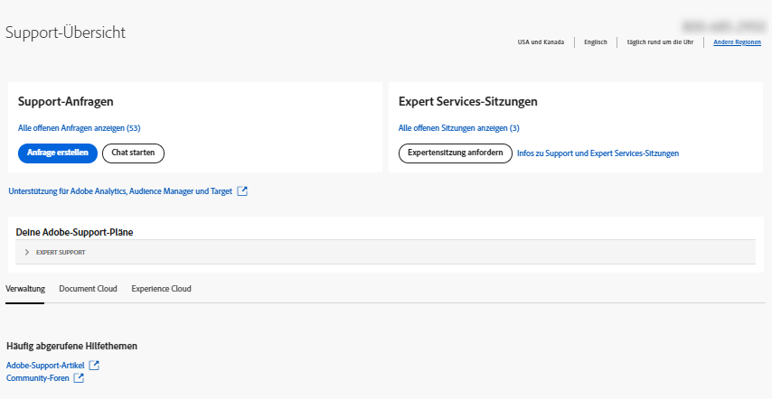

# Unternehmen und Teams | Kundenunterstützung von Adobe kontaktieren

Um die Kundenunterstützung von Adobe zu kontaktieren, navigieren Sie zu **Support** im [Admin Console](https://adminconsole.adobe.com/).

Die **Support-Tab** im [Admin Console](https://adminconsole.adobe.com/) bietet Zugriff auf verschiedene Support-Optionen über eine einfache und benutzerfreundliche Oberfläche. Die im Tab Support verfügbaren Optionen hängen von Ihrem Abonnementplan ab. Klicken Sie für weitere Informationen auf **Weitere Infos** entspricht Ihrem Abonnementplan.

Wenn Sie sich bezüglich Ihres Abonnementplans nicht sicher sind, navigieren Sie zum **Support-Tab** auf [Admin Console](https://adminconsole.adobe.com/)und vergleichen Sie Ihre Ansicht mit den unten stehenden Bildern. Klicken Sie dann auf die entsprechende **Weitere Infos** Link.

## Für Teams-Konto

<!--
[Learn more](https://helpx.adobe.com/enterprise/using/support-for-teams.html)
-->

## Für Unternehmenskonten

<!--
[Learn more](https://helpx.adobe.com/enterprise/using/support-for-enterprise.html)
-->

## Experience Cloud

<!--
[Learn more](https://www.adobe.com/go/ac_ec_not_supported_en)
-->
