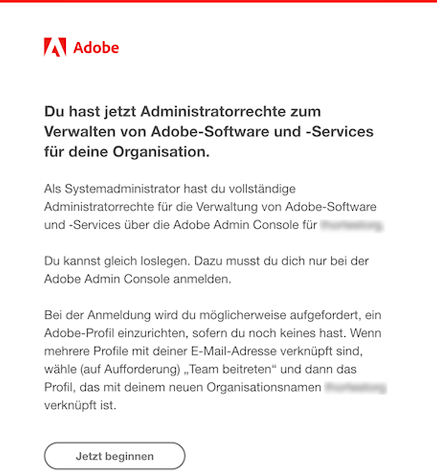
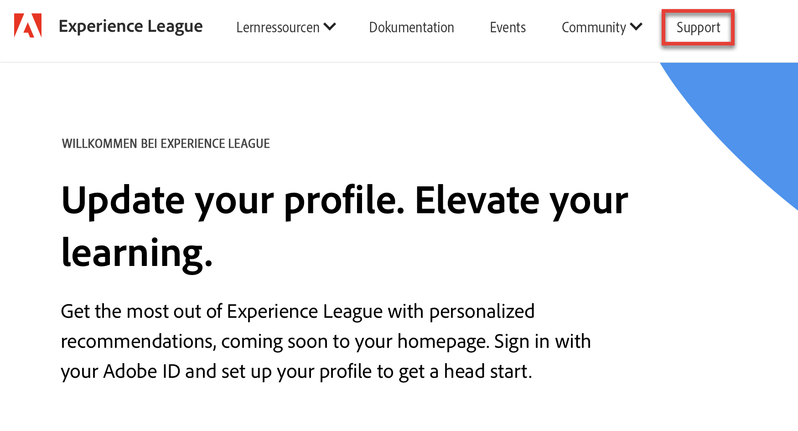
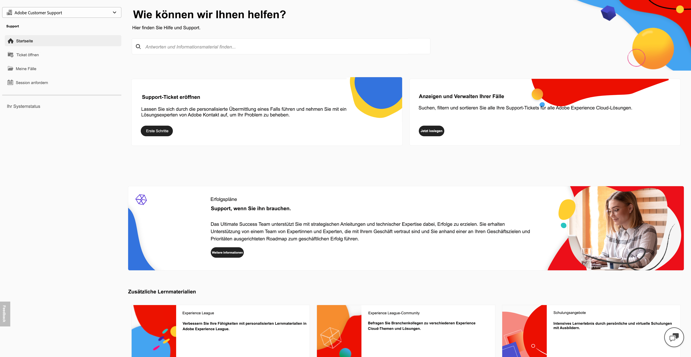
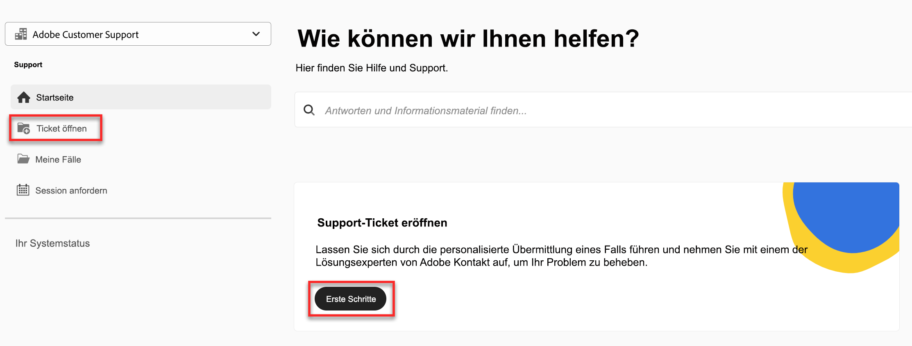
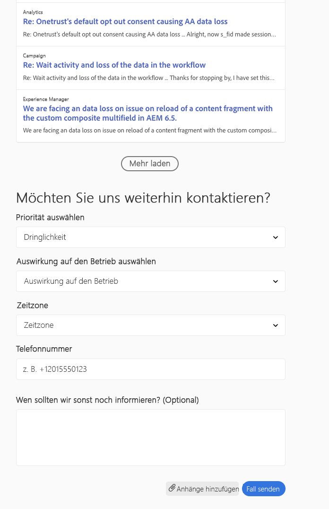

# Adobe-Support-Erlebnis

## Experience League – Support-Tickets

Support-Tickets werden jetzt über [Experience League](https://experienceleague.adobe.com/home#support) eingereicht. Anweisungen zum Senden eines Support-Tickets finden Sie im Abschnitt [Senden eines Support-Tickets](#create-a-support-ticket-with-experience-league).

Wir arbeiten daran, die Interaktion mit dem Adobe-Kunden-Support zu verbessern. Wir möchten alle Support-Vorgänge optimieren, indem wir eine zentrale Anlaufstelle in Experience League bereitstellen. Dadurch wird Ihre Interaktion mit dem Adobe-Support deutlich vereinfacht. Denn das System bündelt Ihren gesamten Service-Verlauf an einer zentralen Stelle, über die Sie fortan auch alle weiteren Support-Anfragen per Telefon, Web und Chat aufgeben können.

Wenn Sie Adobe Commerce verwenden, finden Sie weitere Informationen unter [Support-Ticket senden](https://experienceleague.adobe.com/de/docs/commerce-knowledge-base/kb/help-center-guide/magento-help-center-user-guide#support-case) im Benutzerhandbuch für Experience League-Support für Adobe Commerce.

## Für den Support zugelassene Rollen zur Ticket-Übermittlung erforderlich {#submit-ticket}

Damit Sie ein Support-Ticket in [Experience League](https://experienceleague.adobe.com/home#support) einreichen können, muss Ihnen von einem Systemadministrator bzw. einer Systemadministratorin die Support-Administratorrolle zugewiesen werden. Nur ein Systemadministrator in Ihrem Unternehmen kann diese Rolle zuweisen. Produkt-, Produktprofil- und andere Administratorrollen können die Support-Administratorrolle nicht zuweisen und können die Option **[!UICONTROL Anfrage erstellen]** nicht anzeigen, die zum Senden eines Support-Tickets verwendet wird. Weitere Informationen zu den verschiedenen Arten von Admin-Rollen und deren Berechtigungen finden Sie unter [Administratorrollen](admin-roles.md).

Wenn Sie Commerce verwenden, ist der Freigabeprozess für die Übermittlung von Support-Tickets anders. Weitere Informationen finden Sie im Experience League-Support-Benutzerhandbuch für Adobe Commerce unter [Shared access: grant privileges for other users to access your account](https://experienceleague.adobe.com/de/docs/commerce-knowledge-base/kb/help-center-guide/magento-help-center-user-guide#shared-access) (Zugriff freigeben: anderen Benutzenden Berechtigungen für den Zugriff auf Ihr Konto gewähren).

### Hinzufügen von Support-Berechtigungen zu einer Organisation

Die Support-Administratorrolle ist eine nicht administrative Rolle, die Zugriff auf Support-bezogene Informationen hat. Support-Administratoren können Problemberichte anzeigen, erstellen und verwalten.

So fügen Sie einen Administrator hinzu oder laden ihn ein:

1. Wählen Sie in der Admin Console **[!UICONTROL Benutzer]** > **[!UICONTROL Administratoren]**.
1. Klicken Sie auf **[!UICONTROL Administrator hinzufügen]**.
1. Geben Sie einen Namen oder eine E-Mail-Adresse ein.

   Sie können nach vorhandenen Benutzenden suchen oder neue Benutzende hinzufügen, indem Sie eine gültige E-Mail-Adresse angeben und die entsprechenden Felder am Bildschirm ausfüllen.

   

1. Klicken Sie auf **[!UICONTROL Weiter]**. Eine Liste der Administratorrollen öffnet sich.

So weisen Sie Benutzenden die Support-Admin-Rolle zu (wodurch Benutzende den Support kontaktieren können):

1. Wählen Sie die Option **[!UICONTROL Support-Administrator]** aus.

   

1. Wählen Sie eine der beiden folgenden Optionen aus:

   * Option 1: **[!UICONTROL Standard-Support-Administrator]**. Wählen Sie diese Option aus, wenn Sie Benutzenden Support-Zugriff auf alle Lösungen (außer Marketo Engage) gewähren möchten.
   * Option 2: **[!UICONTROL Produkt-Support-Administrator]**: Wählen Sie diese Option für den Marketo Engage-Support aus. Wählen Sie die Marketo Engage-Instanzen aus, auf die Benutzende Support-Zugriff erhalten sollen.

   

1. Wenn Sie die Auswahl vorgenommen haben, klicken Sie auf **[!UICONTROL Speichern]**.

Der Benutzer erhält per E-Mail eine Einladung zu den neuen Administratorrechten von `message@adobe.com`.

Benutzer müssen in der E-Mail auf **Erste Schritte** klicken, um Mitglied des Unternehmens zu werden. Wenn neue Administratoren den Link **Erste Schritte** in der E-Mail-Einladung nicht anklicken, können sie sich nicht bei der Admin Console anmelden.

Im Rahmen des Anmeldeprozesses können Benutzer aufgefordert werden, ein Benutzerprofil einzurichten, wenn sie noch keines haben. Wenn Benutzende mehrere Profile haben, die mit ihrer E-Mail-Adresse verknüpft sind, müssen sie (bei entsprechender Aufforderung) auf „Dem Team beitreten“ klicken und danach das mit dem neuen Unternehmen verknüpfte Profil auswählen.**&#x200B;**

Weitere Informationen finden Sie in den Anweisungen zur [Bearbeitung von Unternehmens-Administratorrolle](admin-roles.md#add-enterprise-role) in der Dokumentation zu Administratorrollen. Beachten Sie, dass nur ein Systemadministrator für Ihr Unternehmen diese Rolle zuweisen kann. Weitere Informationen zur Administrationshierarchie finden Sie in der Dokumentation zu [Administratorrollen](admin-roles.md).

### Erstellen eines Support-Tickets über Experience League

Die Übermittlung von Support-Anfragen erfolgt jetzt direkt über die Experience League-Support-Plattform. Dies ist ein Self-Service-Portal, das kürzlich neu gestaltet wurde. Es bietet Kunden und Kundinnen mit entsprechenden Berechtigungen verbesserte Personalisierungsmöglichkeiten und höhere Benutzerfreundlichkeit.

1. Um ein Ticket über [Experience League](https://experienceleague.adobe.com/home#support) zu erstellen, wählen Sie die Registerkarte **[!UICONTROL Support]** in der oberen Navigation.
   
1. Auf der Support-Startseite können Sie einfach zu Ihren offenen Support-Tickets navigieren, ein neues Ticket senden, die wichtigsten Support-Artikel anzeigen oder auf Lernmaterialien zugreifen.
   
1. Um ein Ticket zu senden, wählen Sie **[!UICONTROL Support-Ticket eröffnen]** (Open a support ticket). Sie können auch die Option **[!UICONTROL Ticket eröffnen]** (Open Ticket) im Seitenleistenmenü auswählen. Sie gelangen daraufhin auf die Ticket-Erstellungs-Seite, wo Sie den Produktnamen (Audience Manager, Campaign, Target usw.) sowie den Titel und die Beschreibung des Problems eingeben. Um die Fehlerbehebung zu beschleunigen, sollten Sie das Problem möglichst genau beschreiben.
   
1. Füllen Sie am Ende des Formulars die folgenden Felder aus. Bei der Auswahl einer Lösungsoption werden Ihnen folgende Fragen gestellt. Manche Lösungen verfügen über zusätzliche Felder:

   * Priorität des Problems (niedrig, mittel, hoch, kritisch)
   * Auswirkung auf den Betrieb
   * Zeitzone des Kunden bzw. der Kundin (Nord- und Südamerika, EMEA, APAC)

   Weitere Informationen dazu, wie sich die Priorität von Fällen und die geschäftlichen Auswirkungen auf die Support-Antwortzeiten auswirken, finden Sie [Gezielte anfängliche Antwortzeiten für Support](https://experienceleague.adobe.com/en/docs/support-resources/data-sheets/overview#targeted-initial-response-times-for-support) in der Dokumentation zu Erfolgsplänen und Ressourcen.

>[!TIP]
>
> Wenn Sie die Option **[!UICONTROL Anfrage erstellen]** oder die Registerkarte **[!UICONTROL Support]** nicht sehen, kontaktieren Sie einen Systemadministrator bzw. eine Systemadministratorin, um die Support-Administratorrolle zugewiesen zu bekommen.

>[!NOTE]
>
> Führt das Problem zu Ausfällen oder schwerwiegenden Unterbrechungen eines Produktionssystems, wird eine Telefonnummer zur sofortigen Hilfe bereitgestellt.

<!--

## What About the Legacy Systems?

New Tickets/Cases will no longer be able to be submitted in legacy systems as of May 11th.  The [Admin Console](https://adminconsole.adobe.com/) will be used to submit new tickets/cases.

### Existing Tickets/Cases

* Between May 11th and May 20th the legacy systems will remain available to work existing tickets/cases to completion.
* Beginning May 20th the support team will migrate remaining open cases from the legacy systems to the new support experience.  You will receive an email notification regarding how to contact support to continue to work these cases.
-->
