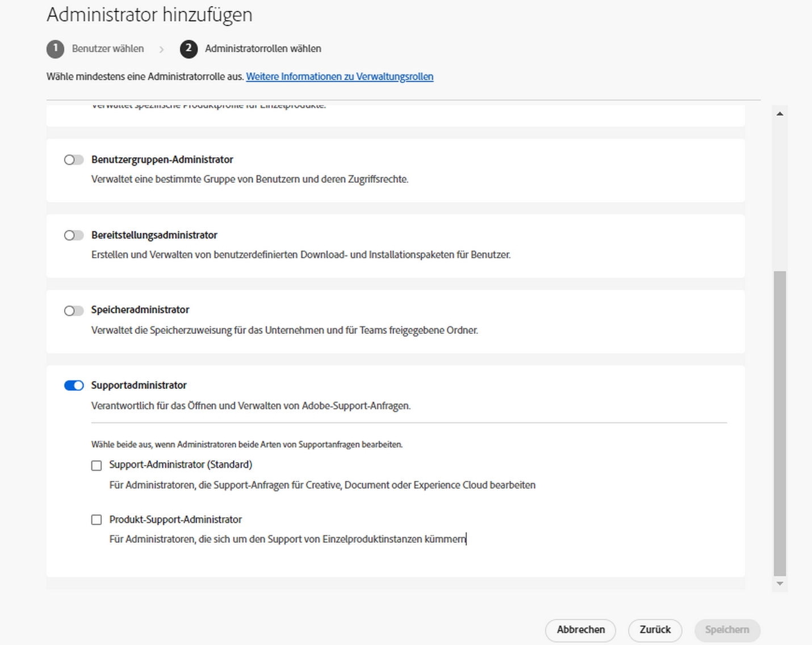
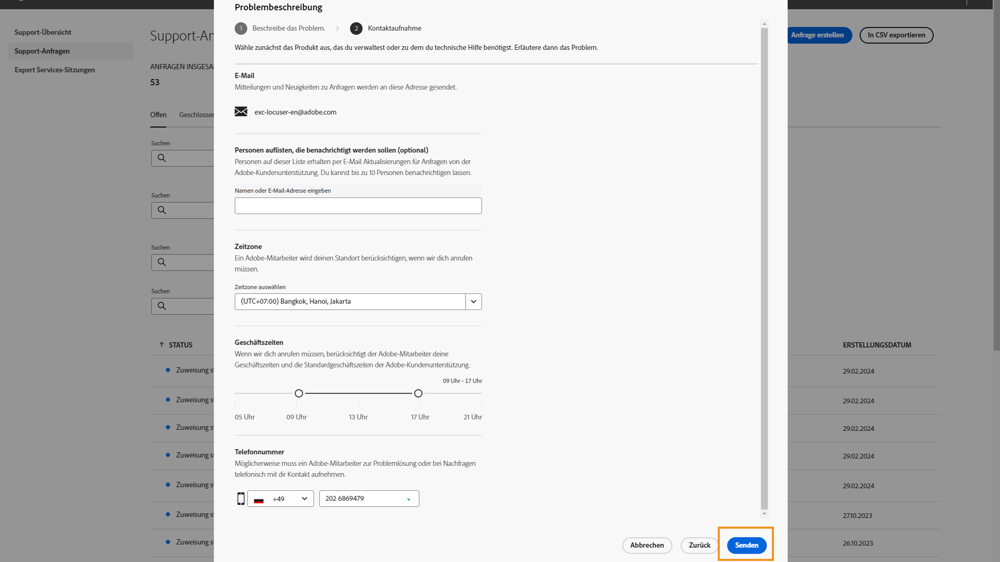

# Adobe-Support-Erlebnis

## Support-Tickets via Admin Console

Ab sofort können Support-Tickets über die [Admin Console](https://adminconsole.adobe.com/) gesendet werden. Anweisungen zum Senden eines Support-Tickets finden Sie im Abschnitt [Senden eines Support-Tickets](#submit-ticket).

Wir arbeiten daran, die Interaktion mit dem Adobe-Kunden-Support zu verbessern. Die Neuerung beinhaltet die Zentralisierung aller Support-Vorgänge in Adobe Admin Console Portal. Dadurch wird Ihre Interaktion mit dem Adobe-Support deutlich vereinfacht. Denn das System bündelt Ihren gesamten Service-Verlauf an einer zentralen Stelle, über die Sie fortan auch alle weiteren Support-Anfragen per Telefon, Web und Chat aufgeben können.

## Senden eines Support-Tickets über die Admin Console {#submit-ticket}

Damit Sie ein Support-Ticket über die [Admin Console](https://adminconsole.adobe.com/) senden können, muss Ihnen von einem Systemadministrator die Support-Administratorrolle zugewiesen werden. Nur ein Systemadministrator in Ihrem Unternehmen kann diese Rolle zuweisen. Produkt-, Produktprofil- und andere Administratorrollen können die Support-Administratorrolle nicht zuweisen und können die Option **[!UICONTROL Anfrage erstellen]** nicht anzeigen, die zum Senden eines Support-Tickets verwendet wird. Weitere Informationen finden Sie in der Dokumentation [Kundenunterstützung für Unternehmen und Teams](customer-care.md).

### Zuweisen der Support-Administratorrolle

Die Support-Administratorrolle ist eine nicht administrative Rolle, die Zugriff auf Support-bezogene Informationen hat. Support-Administratoren können Problemberichte anzeigen, erstellen und verwalten.

So fügen Sie einen Administrator hinzu oder laden ihn ein:

1. Wählen Sie in der Admin Console **[!UICONTROL Benutzer]** > **[!UICONTROL Administratoren]**.
1. Klicken Sie auf **[!UICONTROL Administrator hinzufügen]**.
1. Geben Sie einen Namen oder eine E-Mail-Adresse ein.

   Sie können nach vorhandenen Benutzern suchen oder einen neuen Benutzer hinzufügen, indem Sie eine gültige E-Mail-Adresse angeben und die Informationen auf dem Bildschirm ausfüllen.

   

1. Klicken Sie auf **[!UICONTROL Weiter]**. Eine Liste der Administratorrollen öffnet sich.

So weisen Sie einem Benutzer eine Support-Admin-Rolle zu (ermöglichen Sie es einem Benutzer, sich an den Support zu wenden):

1. Wählen Sie die **[!UICONTROL Support-Administrator]** -Option.

   

1. Wählen Sie eine der beiden folgenden Optionen aus:

   * Option 1: **[!UICONTROL Grundlegender Support-Administrator]**. Wählen Sie diese Option aus, wenn Sie dem Benutzer-Support Zugriff auf alle Lösungen (außer Marketo) gewähren möchten.
   * Option 2: **[!UICONTROL Support-Administrator]**: Wählen Sie diese Option für den Marketo-Support aus. Wählen Sie die Marketo-Instanzen aus, auf die der Benutzersupport Zugriff erhalten soll.

   

1. Nachdem Sie die Auswahl vorgenommen haben, klicken Sie auf **[!UICONTROL Speichern]**.

Der Benutzer erhält per E-Mail eine Einladung zu den neuen Administratorrechten von `message@adobe.com`.

Benutzer müssen in der E-Mail auf **Erste Schritte** klicken, um Mitglied des Unternehmens zu werden. Wenn neue Administratoren den Link **Erste Schritte** in der E-Mail-Einladung nicht anklicken, können sie sich nicht bei der Admin Console anmelden.

Im Rahmen des Anmeldeprozesses können Benutzer aufgefordert werden, ein Benutzerprofil einzurichten, wenn sie noch keines haben. Wenn mehrere Profile mit der E-Mail-Adresse verknüpft sind, müssen die Benutzer auswählen **Team beitreten** (wenn Sie dazu aufgefordert werden) und wählen Sie dann das mit der neuen Organisation verknüpfte Profil aus.

### Erstellen eines Support-Tickets über die Admin Console

Um ein Ticket mit der [Admin Console](https://adminconsole.adobe.com/) zu erstellen, wählen Sie die Registerkarte **[!UICONTROL Support]** in der oberen Navigation. Die [!UICONTROL Support-Zusammenfassung] wird angezeigt. Wählen Sie anschließend die Option **[!UICONTROL Anfrage erstellen]**.

>[!TIP]
>
> Wenn Sie die Option **[!UICONTROL Anfrage erstellen]** oder die Registerkarte **[!UICONTROL Support]** nicht sehen, müssen Sie einen Systemadministrator kontaktieren, damit er Ihnen die Support-Administratorrolle zuweist.

Ein Dialogfeld wird angezeigt, in dem Sie einen Problemtyp auswählen können. Wählen Sie den Problemtyp aus, der Ihr Problem oder Ihre Frage am besten beschreibt, und wählen Sie dann **[!UICONTROL Anfrage erstellen]** unten rechts.

Das Dialogfeld **[!UICONTROL Anfrage erstellen]** wird angezeigt. Sie werden gebeten, einige Informationen wie das Produkt, die Priorität, die Beschreibung und Screenshots anzufügen, um das Problem genauer zu beschreiben. Wählen Sie **[!UICONTROL Weiter]**, um fortzufahren.

>[!NOTE]
>
> Führt das Problem zu Ausfällen oder extrem schwerwiegenden Unterbrechungen eines Produktionssystems, wird eine Telefonnummer zur sofortigen Unterstützung bereitgestellt.

Auf der nächsten Seite können Sie Kontaktinformationen ausfüllen und die beste Zeit für die Kontaktaufnahme durch den Adobe-Support angeben. Wählen Sie nach Abschluss **[!UICONTROL Senden]** unten rechts und Ihr Ticket wird an den Adobe-Support gesendet.

<!--

## What About the Legacy Systems?

New Tickets/Cases will no longer be able to be submitted in legacy systems as of May 11th.  The [Admin Console](https://adminconsole.adobe.com/) will be used to submit new tickets/cases.

### Existing Tickets/Cases

* Between May 11th and May 20th the legacy systems will remain available to work existing tickets/cases to completion.
* Beginning May 20th the support team will migrate remaining open cases from the legacy systems to the new support experience.  You will receive an email notification regarding how to contact support to continue to work these cases.
-->
