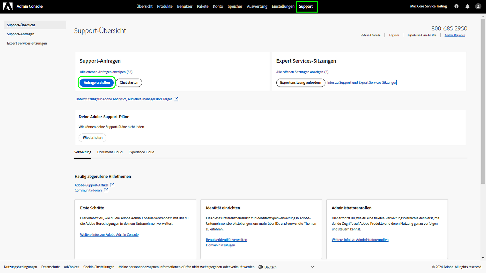

# Adobe-Kundensupport-Erlebnis

## Support-Tickets via Admin Console

Support-Tickets können jetzt über die [Admin Console](https://adminconsole.adobe.com/) gesendet werden. Anweisungen zum Senden eines Support-Tickets finden Sie im Abschnitt [Senden eines Support-Tickets](#submit-ticket).

Wie bereits angekündigt, implementieren wir schrittweise ein verbessertes System für unseren Produkt-Support, dies als erstes für Adobe Experience Manager und Adobe Campaign. Die Neuerung beinhaltet die Zentralisierung aller Support-Vorgänge in Adobe Admin Console Portal. Sobald Ihre Organisation live ist, kann sie einfach auf den Adobe-Support zugreifen. über ein gemeinsames System für alle Produkte einen besseren Einblick in Ihren Serviceverlauf erhalten; und Hilfe per Telefon, Web und Chat über ein einzelnes Portal anfordern.

## Senden eines Support-Tickets für Admin Consolen {#submit-ticket}

Um ein Support-Ticket in [Admin Console](https://adminconsole.adobe.com/) einzureichen, muss ein Systemadministrator die Rolle &quot;Support-Administrator&quot;zugewiesen haben. Nur ein Systemadministrator in Ihrem Unternehmen kann diese Rolle zuweisen. Produkt-, Produktprofil- und andere Administratorrollen können die Administratorrolle &quot;Support&quot;nicht zuweisen und können die Option **[!UICONTROL Fall erstellen]** nicht anzeigen, die zum Senden eines Support-Tickets verwendet wird. Weitere Informationen finden Sie in der [Dokumentation zur Kundenunterstützung für Unternehmen und Teams](https://helpx.adobe.com/de/enterprise/using/support-and-expert-services.html).

### Zuweisen der Administratorrolle &quot;Support&quot;

Die Administratorrolle &quot;Support&quot;ist eine nicht administrative Rolle, die Zugriff auf unterstützungsbezogene Informationen hat. Support-Administratoren können Problemberichte anzeigen, erstellen und verwalten.

Um die Rolle &quot;Support-Administrator&quot;zuzuweisen, befolgen Sie die Anweisungen [Unternehmensadministratorrolle bearbeiten](https://helpx.adobe.com/enterprise/using/admin-roles.html#add-admin-teams) in der Dokumentation zu Administratorrollen . Beachten Sie, dass nur ein Systemadministrator für Ihre Organisation diese Rolle zuweisen kann. Weitere Informationen zur Verwaltungshierarchie finden Sie in der Dokumentation [Admin-Rollen](https://helpx.adobe.com/enterprise/admin-guide.html/enterprise/using/admin-roles.ug.html) .

### Support-Ticket mit Admin Console erstellen

Um ein Ticket mit [Admin Console](https://adminconsole.adobe.com/) zu erstellen, wählen Sie die Registerkarte **[!UICONTROL Support]** im oberen Navigationsbereich aus. Die Seite [!UICONTROL Support Summary] wird angezeigt. Wählen Sie als Nächstes die Option **[!UICONTROL Create Case]** aus.

>[!TIP]
>
> Wenn die Option **[!UICONTROL Fall erstellen]** oder die Registerkarte **[!UICONTROL Support]** nicht angezeigt werden kann, müssen Sie sich an einen Systemadministrator wenden, um die Administratorrolle &quot;Support&quot;zuzuweisen.

Ein Dialogfeld wird angezeigt, in dem Sie einen Problemtyp auswählen können. Wählen Sie den Problemtyp aus, der Ihr Problem oder Ihre Frage am besten beschreibt, und wählen Sie dann unten rechts **[!UICONTROL Fall erstellen]** aus.

Das Dialogfeld **[!UICONTROL Create Case]** wird angezeigt. Sie werden gebeten, einige Informationen wie das Produkt, die Priorität, die Beschreibung und Screenshots anzufügen, die Ihnen helfen, das Problem zu beschreiben. Wählen Sie **[!UICONTROL Next]** aus, um fortzufahren.

>[!NOTE]
>
> Führt das Problem zu Ausfällen oder extrem schwerwiegenden Unterbrechungen eines Produktionssystems, wird eine Telefonnummer zur sofortigen Unterstützung bereitgestellt.

Auf der nächsten Seite können Sie Kontaktinformationen ausfüllen und die beste Zeit für die Kontaktaufnahme mit Ihnen durch den Adobe-Support bereitstellen. Wählen Sie nach Abschluss **[!UICONTROL Submit]** unten rechts aus und Ihr Ticket wird an den Adobe-Support gesendet.

## Was geschieht mit den früheren Systemen?

Neue Tickets/Fälle können ab dem 11. Mai nicht mehr über die früheren Systeme eingereicht werden.  Fortan wird zum Einreichen neuer Tickets/Fälle nur noch [Admin Console](https://adminconsole.adobe.com/) verwendet.

### Bestehende Tickets/Fälle

* Die früheren Systeme bleiben vom 11. Mai bis 20. Mai verfügbar, um bestehende Tickets/Fälle abzuschließen.
* Alle ab dem 20. Mai noch in früheren Systemen bestehenden Fälle migriert das Support-Team zur neuen Support-Umgebung.  Sie werden per E-Mail darüber benachrichtigt, wie Sie den Support betreffend die weitere Bearbeitung dieser Fälle kontaktieren können.

