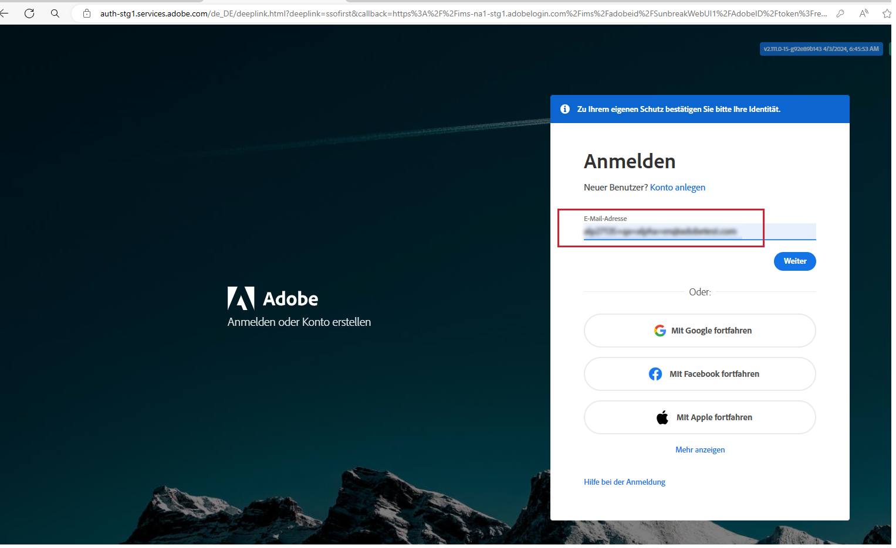
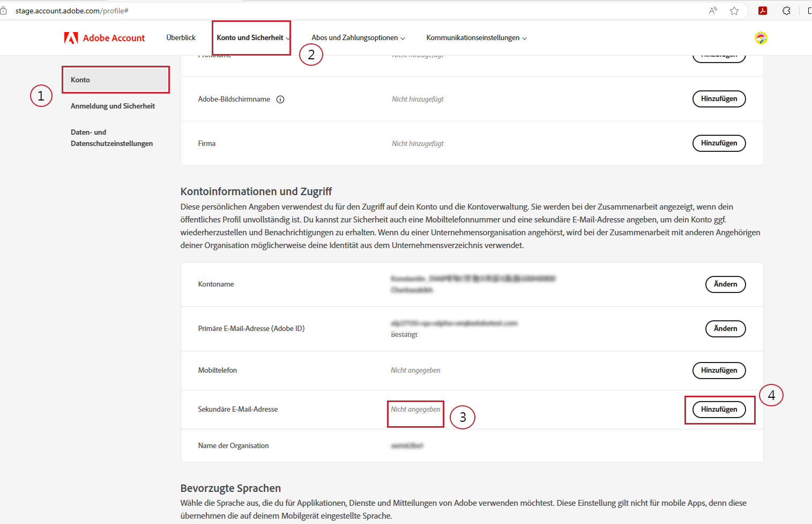
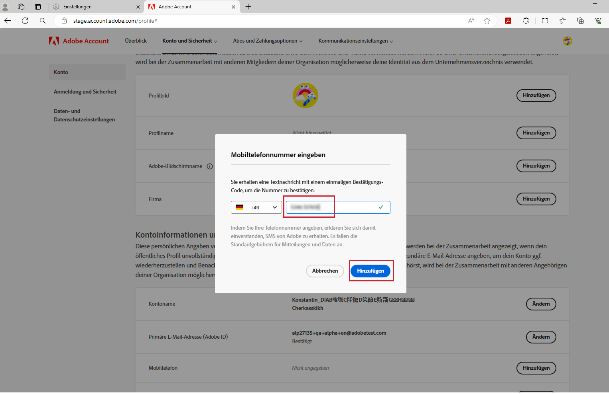
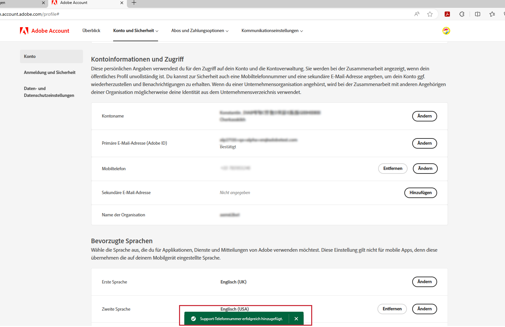

# Bevorzugte Telefonnummer für den Support angeben

Wenn Ihnen eine Administratorrolle zugewiesen wird, wie z. B. „Produkt-Support-Admin“, werden Sie in einer E-Mail darüber informiert werden, dass Sie über Administratorrechte für die Verwaltung der Instanz verfügen, für die Ihnen Administratorrechte erteilt wurden.

Die E-Mail enthält jetzt den Text unten in Rot, der erklärt, wie Sie zu Ihrem Kontoprofil gehen und uns Ihre bevorzugte Telefonnummer für den Support mitteilen können.

So geben Sie Ihre bevorzugte Telefonnummer an:

1. Klicken Sie auf den Link **Kontoprofil**, um ein neues Fenster zu öffnen und sich bei `account.adobe.com` anzumelden.

   

1. Führen Sie den Anmeldevorgang durch. Der Bildschirm unten wird auf `account.adobe.com` angezeigt.
1. Klicken Sie dann auf die Registerkarten „Konto und Sicherheit“ > „Konto“, um das Feld für Telefonnummer für den Support anzuzeigen.
1. Fügen Sie hier eine Telefonnummer hinzu, die wir für Ihre Support-Bedürfnisse verwenden sollen.

